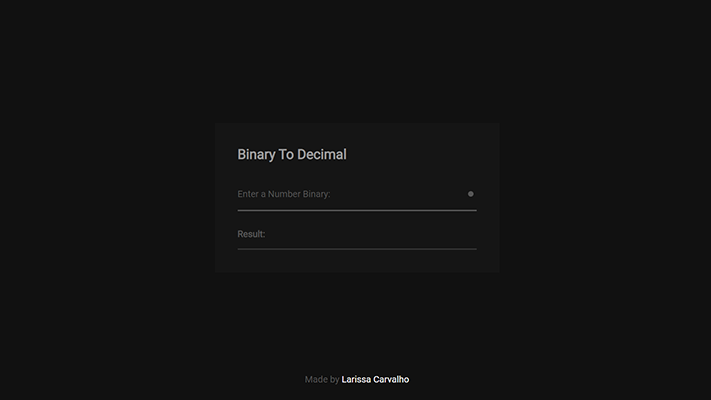
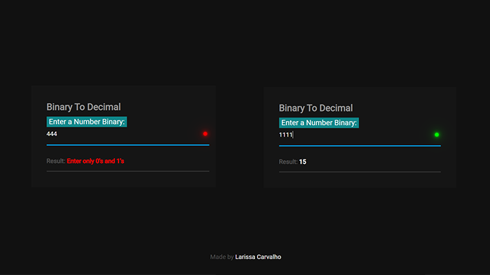

# Bin2Dec
> Binary to Decimal Number Converter

## In Use:

Demo: https://bin2dec-inky.vercel.app/

Idea from [App Ideas](https://github.com/florinpop17/app-ideas)

Binary is the number system all digital computers are based on.
Therefore it's important for developers to understand binary, or base 2,
mathematics. The purpose of Bin2Dec is to provide practice and
understanding of how binary calculations.

Bin2Dec allows the user to enter strings of up to 8 binary digits, 0's
and 1's, in any sequence and then displays its decimal equivalent.

This challenge requires that the developer implementing it follow these
constraints:

-   Arrays may not be used to contain the binary digits entered by the user
-   Determining the decimal equivalent of a particular binary digit in the
    sequence must be calculated using a single mathematical function, for
    example the natural logarithm. It's up to you to figure out which function
    to use.

## User Stories

-   [x] User can enter up to 8 binary digits in one input field
-   [x] User must be notified if anything other than a 0 or 1 was entered
-   [x] User views the results in a single output field containing the decimal (base 10) equivalent of the binary number that was entered

## Bonus Features

-   [x] User can enter a variable number of binary digits

## :rocket: Tech Used:
-   HTML5
-   CSS3
-   JavaScript
 

## Meta

Larissa Carvalho - larissa_carvalho_almeida@hotmail.com

  

  

  

Made by Larissa Carvalho 💙

